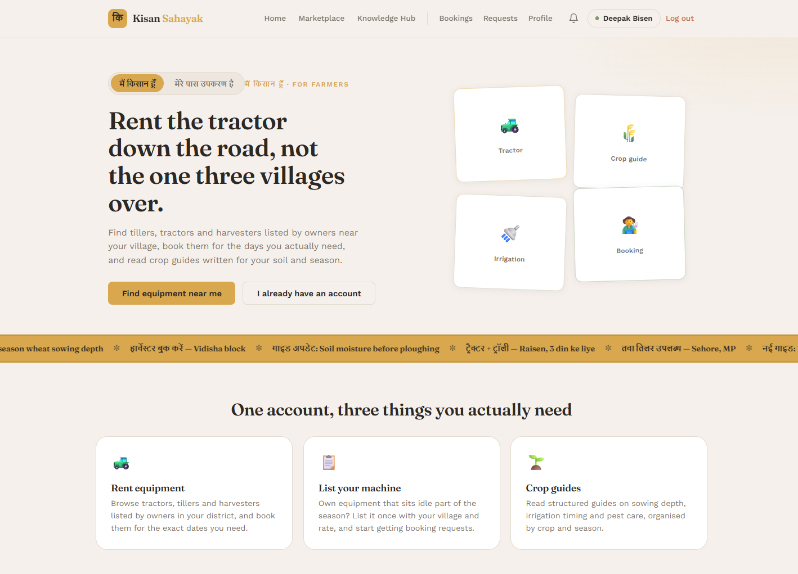
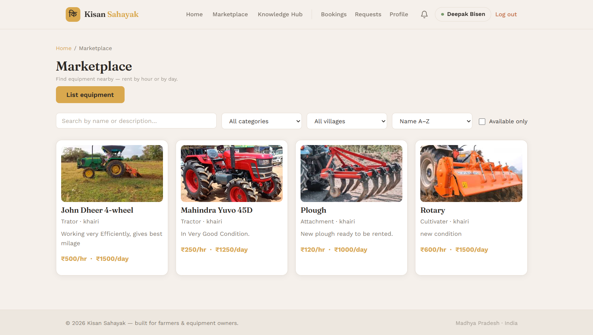

# Kisan Sahayak — Farm Equipment Rental Platform
# (किसान सहायक) 🌾🚜
A full-stack microservice platform connecting farmers to rent and list agricultural equipment. Built with Spring Boot (microservices) and Angular.
 
---
 
## 🌟 Key Features
 
### 🚜 Equipment Marketplace & Rental Booking
- **List Equipment:** Farmers and equipment owners can list machinery (tractors, tillers, harvesters, sprayers) with hourly/daily pricing, availability, and images.
- **Rental Bookings:** Renters can search available machinery, schedule booking dates, calculate estimated costs, and track booking statuses (`PENDING`, `APPROVED`, `REJECTED`, `COMPLETED`, `CANCELLED`).
- **Owner Dashboard:** Equipment owners can review, approve, or decline incoming rental requests for their machinery.
### 📚 Crop Knowledge & Advisory Hub
- **Crop Guides:** Comprehensive library of crop management guides featuring optimal sowing times, soil requirements, irrigation schedules, disease management, and harvesting advice.
- **Search & Filter:** Easily discover crop guides based on season (Kharif, Rabi, Zaid) or crop type.
### 🔐 Security & Identity Management
- **Role-Based Access Control (RBAC):** Distinct permissions for Farmers, Equipment Owners, and System Administrators (`ROLE_USER`, `ROLE_ADMIN`).
- **JWT Authentication:** Stateless authentication secured with JSON Web Tokens across all API endpoints and microservices.
### 🔔 Real-time Notifications & User Management
- **Booking Alerts:** Automated notification delivery to owners and renters upon booking creation, approval, or status update.
- **User Profiles:** Seamless management of farmer profiles, contact details, and listing history.
---
## 📸 Screenshots
 
| Home | Marketplace |
|------|-------------|
|  |  |

---
## Architecture

```
kisan-sahayak-backend/          # Java / Spring Boot
├── discovery-server/           # Eureka service registry (port 8761)
├── api-gateway/                # Spring Cloud Gateway (port 8080)
├── kisan-user/                 # User management microservice
│   ├── user-api/               #   DTOs, controller interfaces
│   ├── user-service/           #   Business logic, security
│   └── user-app/               #   Controller impl, repository, main
├── kisan-marketplace/          # Equipment & booking microservice
│   ├── marketplace-api/        #   DTOs, controller interfaces, entities
│   └── marketplace-service/    #   Business logic, controller impl
└── kisan-knowledge/            # Crop knowledge hub microservice
    ├── knowledge-api/          #   DTOs, controller interfaces
    └── knowledge-service/      #   Business logic, controller impl

kisan-sahayak-frontend/         # Angular 17+ standalone app (port 4200)
```

## Tech Stack

| Layer | Technology |
|-------|-----------|
| Backend | Java 17, Spring Boot 3.x, Spring Cloud |
| Auth | JWT (HS256), Spring Security |
| Database | MariaDB, JPA / Hibernate |
| Frontend | Angular 17+, Signals, RxJS |
| Service Discovery | Netflix Eureka |
| API Gateway | Spring Cloud Gateway |
| Build | Maven (multi-module), npm |

## Prerequisites

- Java 17+
- Node.js 18+ & npm
- MariaDB (or MySQL compatible)
- Maven 3.8+

## Setup

### 1. Database

Create three databases in MariaDB:

```sql
CREATE DATABASE IF NOT EXISTS kisan_user;
CREATE DATABASE IF NOT EXISTS kisan_marketplace;
CREATE DATABASE IF NOT EXISTS knowledge_kisan;
```

### 2. Environment Variables

```powershell
# Copy the example env file (never commit real .env)
copy .env.example .env

# Edit .env with your credentials, then load them
.\load-env.ps1
```

Required variables:

| Variable | Description |
|----------|-------------|
| `JWT_SECRET` | Base64-encoded 256-bit key (must match across services) |
| `DB_USERNAME` | MariaDB username |
| `DB_PASSWORD` | MariaDB password |

### 3. Backend

```powershell
cd kisan-sahayak-backend
mvn clean install -DskipTests
```

Start services in order (each in a separate terminal):

```powershell
# 1. Service Registry
cd discovery-server; mvn spring-boot:run

# 2. Backend services (after loading env vars)
cd api-gateway;      mvn spring-boot:run
cd kisan-user/user-app;      mvn spring-boot:run
cd kisan-marketplace/marketplace-app; mvn spring-boot:run
cd kisan-knowledge/knowledge-app;     mvn spring-boot:run
```

### 4. Frontend

```powershell
cd kisan-sahayak-frontend
npm install
npm run dev
```

The app will be available at `http://localhost:4200`.

## Features

- **User Authentication** — Register/login with phone number + password, JWT-based sessions with auto-refresh on expiry
- **Equipment Marketplace** — Browse, list, search, and rent farm equipment with image upload
- **Booking System** — Request rentals, confirm/cancel bookings, date-overlap detection, availability calendar
- **Role-based Views** — Farmers see their bookings, owners manage their listings
- **Knowledge Hub** — Browse/search crop guides by crop name or season with images and videos
- **Dashboard** — Stats for farmers (active rentals, past bookings) and owners (equipment count, booking requests)
- **In-App Notifications** — Real-time booking status updates (requested, confirmed, completed, cancelled)
- **Admin Panel** — User management and system oversight
- **Profile Management** — Edit profile, change password, delete account with confirmation

## API Endpoints (via Gateway at `http://localhost:8080`)

### User Service (`/api/users`)
| Method | Path | Auth |
|--------|------|------|
| POST | `/register` | No |
| POST | `/login` | No |
| POST | `/refresh` | No |
| GET | `/{userId}` | Yes |
| GET | `/phone/{phone}` | Yes |
| PUT | `/update/{userId}` | Yes |
| DELETE | `/delete/{userId}` | Yes |

### Marketplace (`/api/marketplace`)
| Method | Path | Auth |
|--------|------|------|
| GET | `/equipment` | No |
| GET | `/equipment/{id}` | No |
| POST | `/equipment` | Yes |
| PUT | `/equipment/{id}` | Yes |
| DELETE | `/equipment/{id}` | Yes |
| DELETE | `/equipment/owner/{ownerId}` | Yes |
| POST | `/bookings` | Yes |
| PATCH | `/bookings/{id}/status` | Yes |
| PATCH | `/bookings/{id}/cancel` | Yes |

### Knowledge Hub (`/api/knowledge/guides`)
| Method | Path | Auth |
|--------|------|------|
| GET | `/all` | No |
| GET | `/{id}` | No |
| GET | `/search/crop/{crop}` | No |
| GET | `/search/season/{season}` | No |
| POST | `` | Yes |
| PUT | `/{id}` | Yes |
| DELETE | `/{id}` | Yes |

## Ports

| Service | Port |
|---------|------|
| API Gateway | 8080 |
| User Service | 8081 |
| Marketplace | 8082 |
| Knowledge Hub | 8083 |
| Eureka | 8761 |
| Frontend | 4200 |
